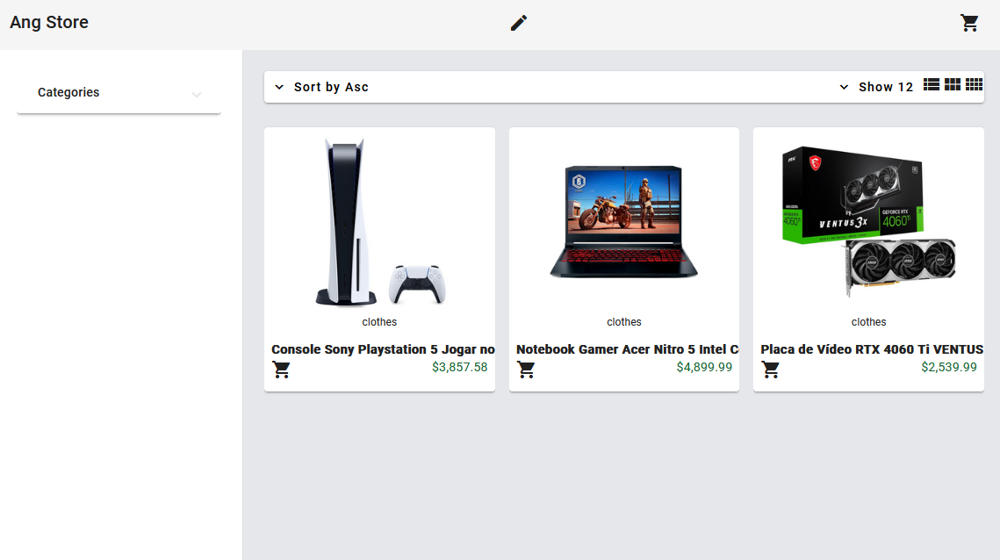
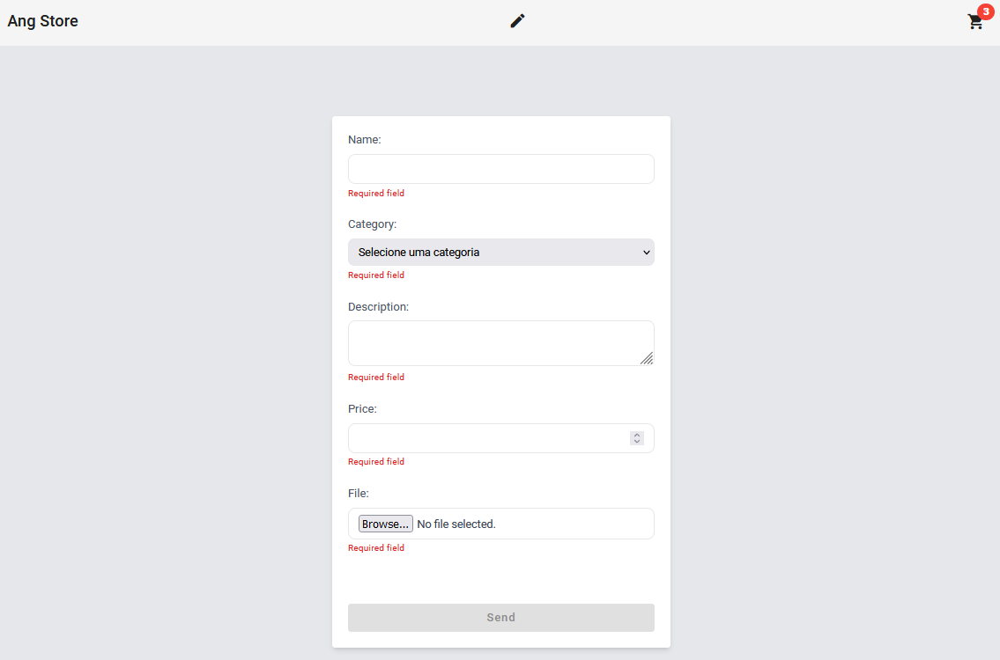
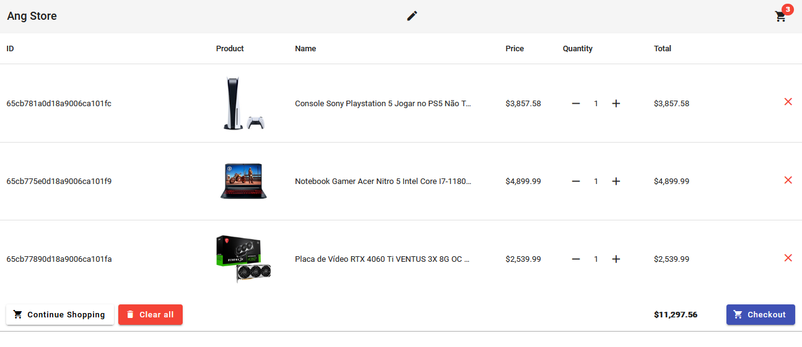
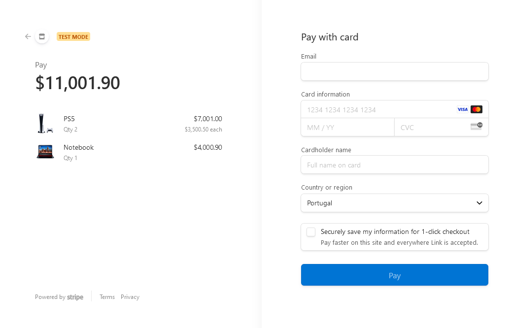

# Ang Store

  

This is a small store website that I developed as part of my study in Angular, Java, Spring Boot and MongoDB. The project aims to practice and enhance my web development skills.

## Technologies Used

- **Java:** Primary programming language for developing the application logic.
- **Spring Boot:** Framework used for building the backend of the web application.
- **Angular:** Frontend framework used for developing the user interface.
- **MongoDB:** NoSQL database used for storing and retrieving data, including links to product images.

## Features

- **Add to Cart:** Users can easily add products to their shopping cart while browsing the store.
- **Buy Items:** Seamless checkout process allowing users to purchase items in their cart with ease. Using the `Stripes`.
- **Pictures Items:** 

    - Utilizes the ImgBB API to store and manage pictures associated with items.
    - MongoDB stores the links to these images, providing a seamless integration for displaying and managing product images.

### Create a new product

### Cart 

### Checkout 

## How to Run the Project

1. Clone this repository.
2. Go to `/frontend` with `cd frontend` 
3. Start the angular serve `ng serve` 
4. The server will be started in `localhost:4200`
5. Go to `/backend/angstore` and run `docker-compose up -d` to start mongoDB

Make sure to configure the database connection correctly in the configuration file.

## Author

[Eduardo Oliveira](https://github.com/duardoliveiras)
